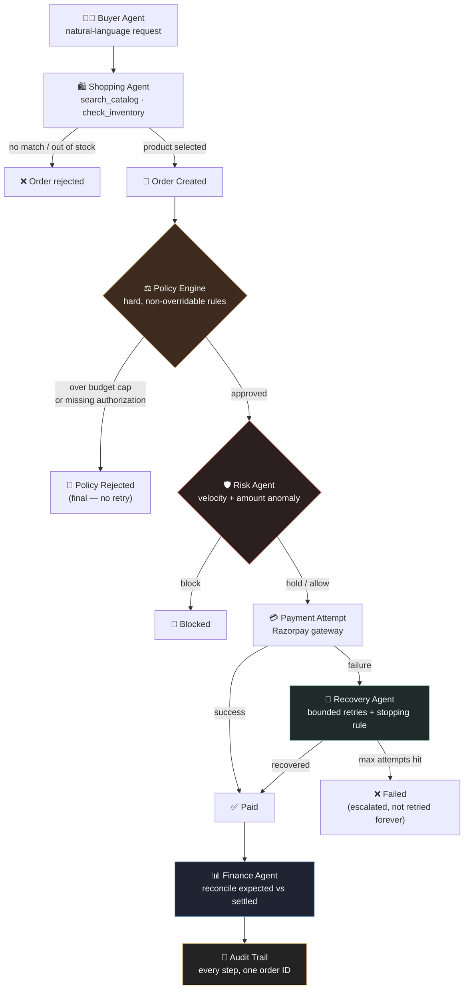
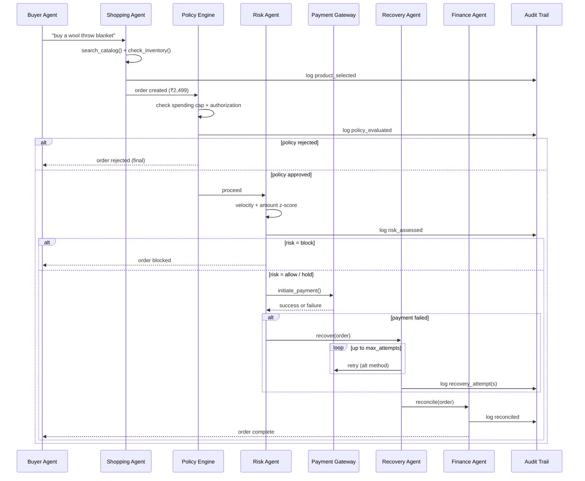

<div align="center">

# 🛒 Razorpay Agentic Commerce

**An AI buyer-agent checkout system — gated by policy, scored for risk, backed by recovery, closed by reconciliation.**

Built for the Razorpay AI Buildathon · Track 01: AI Growth & Agentic Commerce

[](https://www.python.org/)
[](https://fastapi.tiangolo.com/)
[](https://www.sqlalchemy.org/)
[](#tests)
[](#)

[](#tests)
[](#)

**[Live API Docs (Swagger UI)](https://razorpay-agentic-commerce-d5ii.onrender.com/docs)**


</div>

---

## The idea

Most buildathon entries pick one track and build one demo. This is **one
coherent agentic checkout pipeline** where the other three tracks aren't
separate projects — they're composed *stages* the same request flows
through. A single purchase touches product selection, hard policy rules,
probabilistic risk scoring, bounded payment recovery, and financial
reconciliation — all logged to one audit trail.

| Track | Role in this system |
|---|---|
| **01 · AI Growth & Agentic Commerce** | The primary build — the shopping agent + orchestrator |
| **02 · AI Risk Manager** | `risk_agent.py` — defense-only fraud gate (velocity + amount anomaly) |
| **03 · AI Revenue Recovery** | `recovery_agent.py` — bounded retry workflow with a stopping rule |
| **04 · AI Finance Controller** | `finance_agent.py` — reconciliation with honest exception reporting |

---

## How a purchase actually flows



**Why the policy engine and risk agent are two separate boxes:** the
policy engine enforces *deterministic* rules (spending caps, authorization
thresholds) that no agent or LLM can override — a rejection there is
final. The risk agent scores *probabilistic* fraud signals and can land
on "hold" for human review. Conflating the two would let a clever prompt
argue its way past a hard business rule.

---

## One request, every stage — sequence view



---

## Repo layout

```
src/
├── config.py                settings from env
├── db/                       models.py, database.py — orders, products, risk
│                             assessments, recovery attempts, reconciliation, audit log
├── gateway/
│   └── razorpay_client.py    real razorpay-python SDK path + deterministic
│                             local mock (runs fully without live keys)
├── catalog/                  merchant catalog data + keyword search
├── tools/                    explicit, named agent tools — the agent calls
│   ├── catalog_tools.py      these, never the DB directly
│   ├── order_tools.py
│   └── payment_tools.py
├── policies/
│   └── policy_engine.py      hard, non-overridable business rules
├── agents/
│   ├── shopping_agent.py     Track 01 — product selection + reasoning
│   ├── risk_agent.py         Track 02
│   ├── recovery_agent.py     Track 03
│   ├── finance_agent.py      Track 04
│   └── orchestrator.py       thin coordinator — no business logic of its own
├── audit/                     append-only audit trail writer/reader
└── api/main.py                FastAPI app
scripts/
├── seed_data.py               loads a sample merchant + catalog
└── run_demo.py                scripted end-to-end CLI run (good for recording)
tests/                         pytest coverage for every agent, the policy
                                engine, and the full pipeline
```

---

## Running it

```bash
python -m venv venv && source venv/bin/activate   # venv\Scripts\activate on Windows
pip install -r requirements.txt
cp .env.example .env                              # copy .env.example .env on Windows

python -m scripts.seed_data     # creates the DB + sample catalog
python -m scripts.run_demo      # scripted end-to-end trace — good for recording

uvicorn src.api.main:app --reload   # or run it as a live API
Hosted instance (no frontend — this is the FastAPI backend only): Swagger UI →
```

Then, with the API running:

```bash
curl -X POST http://localhost:8000/purchase \
  -H "Content-Type: application/json" \
  -d '{"merchant_id": 1, "buyer_agent_id": "agent-001", "query": "coffee set", "budget_limit": 20000}'

curl http://localhost:8000/orders/1/audit
curl http://localhost:8000/finance/summary
```

---

## Tests

```bash
pytest -v
```

11 tests, all passing:

| Suite | Covers |
|---|---|
| `test_risk_agent.py` | allow/hold/block decisions, velocity gating |
| `test_policy_engine.py` | spending-cap rejection, authorization threshold |
| `test_recovery_agent.py` | bounded retries, the stopping rule actually stops |
| `test_finance_agent.py` | reconciliation matching + honest exception flagging |
| `test_orchestrator.py` | full pipeline end to end, out-of-stock short-circuit |

---

## Using real Razorpay test-mode keys

Set `USE_MOCK_GATEWAY=false` and provide `RAZORPAY_KEY_ID` /
`RAZORPAY_KEY_SECRET` (test-mode, from the Razorpay dashboard) in
`.env`. `src/gateway/razorpay_client.py` then creates real test-mode
orders through the official `razorpay` SDK. A production checkout also
needs the client-side checkout widget + webhook capture — the current
`RazorpayGateway.charge()` creates the server-side order and is the
integration point to wire that in.

---

## Why this shape

Track 01's own bar asks for *"every money action explainable, bounded and
gated... show the audit trail and one failure handled gracefully."*
That's satisfied directly by this pipeline: policy gates enforce hard
limits no agent can override, risk gates score probabilistic fraud
signals before spend, recovery is bounded with a real stopping rule,
reconciliation reports exceptions instead of hiding them, and the audit
trail ties every decision to one order ID from request to settlement.
